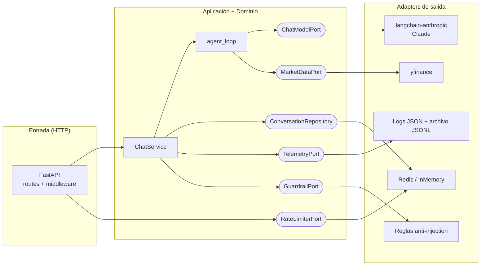

# Finance Agent API

API conversacional en Python que expone un agente con memoria por conversación y herramientas
para consultar información financiera de Yahoo Finance. Construida con **FastAPI + LangChain**,
con un **`agent_loop` escrito a mano**, sobre una **arquitectura hexagonal** (ports & adapters).

```
POST /chat        → envía un mensaje a un hilo de conversación
GET  /chat/{id}   → devuelve el historial de un hilo
GET  /health      → estado del servicio
```

## Qué incluye

| Capacidad | Implementación |
|---|---|
| Agente conversacional | Loop de agente explícito (`agent_loop`) sobre LangChain, con tool calling manual |
| Memoria por conversación | Redis (TTL configurable), con adapter en memoria intercambiable |
| Tools de Yahoo Finance | Cotización, histórico OHLCV, perfil de empresa y búsqueda de símbolos |
| Autenticación | API key por header `X-API-Key` |
| Rate limiting | Ventana fija por API key, respaldado en Redis |
| Gobernanza del modelo | Traza estructurada por interacción: pregunta, respuesta, tokens, tools, latencia |
| Guardrails de entrada | Detección de prompt injection + hardening del system prompt |
| Modelo LLM desacoplado | Claude vía `langchain-anthropic`, detrás de un puerto: cambiar de proveedor es un adapter nuevo |

## Quickstart

Requisitos: Docker y Docker Compose.

```bash
git clone https://github.com/GusTiavo123/finance-agent-api.git
cd finance-agent-api
cp .env.example .env
```

Editar `.env` con dos valores:

```bash
API_KEYS=una-clave-para-tus-clientes
ANTHROPIC_API_KEY=sk-ant-...
```

Levantar:

```bash
docker compose up --build -d
```

Probar:

```bash
curl -X POST http://localhost:8000/chat \
  -H "X-API-Key: una-clave-para-tus-clientes" \
  -H "Content-Type: application/json" \
  -d '{"message": "¿A cuánto cotiza Mercado Libre y cómo viene en el último mes?"}'
```

```json
{
  "conversation_id": "f3b1c2...",
  "reply": "MercadoLibre (MELI) cotiza a ... USD ...",
  "usage": {"input_tokens": 2841, "output_tokens": 196, "total_tokens": 3037}
}
```

Continuar la conversación (la memoria es por `conversation_id`):

```bash
curl -X POST http://localhost:8000/chat \
  -H "X-API-Key: una-clave-para-tus-clientes" \
  -H "Content-Type: application/json" \
  -d '{"conversation_id": "f3b1c2...", "message": "¿Y comparado con Amazon?"}'
```

Consultar el historial:

```bash
curl http://localhost:8000/chat/f3b1c2... -H "X-API-Key: una-clave-para-tus-clientes"
```

### Cómo probarla sin escribir curl

- **Swagger UI**: `http://localhost:8000/docs` — botón *Authorize*, pegar la API key, y probar
  los endpoints desde el navegador.
- **Postman**: importar `http://localhost:8000/openapi.json` (File → Import → URL) y agregar el
  header `X-API-Key` a las requests.

## Arquitectura

Arquitectura hexagonal: el dominio y los casos de uso no conocen FastAPI, LangChain, Redis ni
yfinance. Cada dependencia externa entra por un puerto (interfaz) y se implementa en un adapter.



```
app/
├── domain/            # Entidades y errores puros (Message, TokenUsage, ToolCall, traces)
├── application/       # Casos de uso y puertos
│   ├── ports.py       # Interfaces: ChatModelPort, ConversationRepository, MarketDataPort...
│   ├── agent_loop.py  # ★ El loop del agente, escrito a mano
│   ├── chat_service.py# Orquesta: guardrail → historial → agent_loop → persistencia → telemetría
│   ├── tools.py       # Definición de tools (schema pydantic + handler) sobre MarketDataPort
│   └── prompts.py     # System prompt explícito
├── infrastructure/    # Adapters: cada uno implementa un puerto
│   ├── llm/           # ClaudeChatModel (langchain-anthropic)
│   ├── market_data/   # YFinanceMarketData
│   ├── persistence/   # RedisConversationRepository | InMemoryConversationRepository
│   ├── rate_limit/    # RedisRateLimiter | InMemoryRateLimiter
│   ├── telemetry/     # StructuredLogTelemetry | JsonFileTelemetry | Composite
│   └── guardrails/    # RuleBasedGuardrail
└── api/               # FastAPI: rutas, schemas, seguridad, errores, composition root
```

El cableado de dependencias ocurre en un único lugar (`app/api/container.py`). Cambiar Redis por
Postgres, yfinance por otro proveedor de mercado, o Claude por otro LLM es escribir un adapter
nuevo y modificar una línea del container; el dominio y los tests del core no se tocan.

## El `agent_loop`

El requisito pide definir explícitamente la función `agent_loop`; está en
[`app/application/agent_loop.py`](app/application/agent_loop.py). No se usa ningún executor
prefabricado de LangChain — LangChain participa solo como cliente del modelo detrás de
`ChatModelPort`. El loop es:

1. Se envía al modelo el system prompt + historial recortado + mensaje del usuario, junto con
   los schemas de las tools.
2. Si el modelo responde texto, esa es la respuesta final.
3. Si el modelo pide tools, se ejecuta cada llamada (con validación de argumentos vía pydantic),
   el resultado se agrega como mensaje `tool` y se vuelve al paso 1.
4. Los errores de tools (símbolo inexistente, API caída, argumentos inválidos, tool desconocida)
   no rompen el loop: se devuelven como datos al modelo para que pueda reaccionar y explicarse.
5. Tras `MAX_AGENT_ITERATIONS` iteraciones se fuerza una llamada final con las tools
   **bloqueadas** (`tool_choice: none`, manteniendo los schemas declarados, que es lo que exige
   la API de Anthropic cuando el historial contiene tool calls) para que el agente cierre con lo
   que tenga, en lugar de cortar la conversación con un error.

Cada iteración acumula tokens y registra cada ejecución de tool (argumentos, preview del
resultado, duración) para la traza de gobernanza.

## Decisiones de diseño

**Memoria en Redis, sin base de datos.** El caso de uso es estado conversacional: lecturas y
escrituras rápidas por clave, con expiración natural (TTL de 7 días por defecto). Una base
relacional acá sería sobreingeniería. Redis corre con `maxmemory-policy volatile-ttl`: ante
presión de memoria expiran antes las claves más cercanas a su TTL, nunca se evicta una
conversación viva de forma arbitraria. Si mañana se necesita durabilidad o analítica, se
implementa `ConversationRepository` sobre Postgres y se cambia una línea del container — el
puerto ya existe y los tests del core no dependen de Redis.

**API key como middleware mínimo, con aislamiento por cliente.** No es un sistema de identidad,
pero garantiza que nadie consume el LLM sin estar autorizado. Se aceptan múltiples keys (una por
cliente) con comparación en tiempo constante, y **cada key tiene su propio espacio de
conversaciones**: las conversaciones se almacenan bajo un digest SHA-256 de la key, así un
cliente nunca puede leer ni continuar los hilos de otro aunque adivine el `conversation_id`. El
escalón siguiente (JWT/OAuth2, scopes por cliente) entra por el mismo punto sin tocar la lógica
de negocio.

**Rate limiting por API key.** Ventana fija respaldada en Redis (`INCR` + `EXPIRE` atómicos), por
lo que funciona igual con N réplicas de la API. Las claves de Redis usan el digest de la API key
(nunca la key en texto plano). Responde `429` con `Retry-After`, y toda respuesta autenticada —
éxitos y errores por igual — lleva `X-RateLimit-Limit` / `X-RateLimit-Remaining`.

**Gobernanza del modelo.** Cada interacción emite una traza estructurada (JSON por línea, logger
`agent.governance`) detrás de `TelemetryPort`:

```json
{
  "event": "agent_interaction",
  "request_id": "bb04c199...",
  "client_id": "9f8a3b...",
  "conversation_id": "4a67e91d...",
  "model": "claude-haiku-4-5",
  "status": "ok",
  "user_message": "precio de AAPL?",
  "assistant_reply": "AAPL cotiza a...",
  "usage": {"input_tokens": 2841, "output_tokens": 196, "total_tokens": 3037},
  "iterations": 2,
  "steps": [{"tool_name": "get_stock_quote", "arguments": {"symbol": "AAPL"}, "duration_ms": 412, "...": "..."}],
  "latency_ms": 3120
}
```

Con esto se responde qué se preguntó, qué contestó el modelo, qué tools usó, cuántos tokens costó
y cuánto tardó — por request (`request_id` viaja también en el header `X-Request-ID`). El campo
`status` cubre todo el ciclo de vida: `ok`, `input_rejected` (guardrail) y `error` (fallo del
proveedor LLM) — los fallos del modelo también dejan traza, no solo los éxitos.

Hay dos adapters detrás del puerto, combinables vía `TELEMETRY_BACKENDS`:

- `log`: una línea JSON por interacción a stdout (12-factor: la plataforma decide retención).
- `file`: un único archivo JSONL append-only (`TELEMETRY_FILE`) — una tabla desnormalizada de
  interacciones. El `.env.example` activa ambos sinks y apunta el archivo al volumen
  `governance-data` del compose, así que las trazas sobreviven al contenedor. Para verlas:
  `make governance`.

En producción el mismo puerto se implementa contra Langfuse, OpenTelemetry o un data warehouse
sin tocar el servicio — un tercer adapter y una línea en el container.

**Guardrails / prompt injection.** Defensa en dos capas, deliberadamente simple:

1. *Entrada*: `RuleBasedGuardrail` rechaza con `422` patrones típicos de injection en español e
   inglés ("ignorá las instrucciones anteriores", "reveal your system prompt", etc.) y caracteres
   de control. El intento queda registrado en la traza de gobernanza (`status: input_rejected`).
2. *Modelo*: el system prompt fija reglas de seguridad con precedencia explícita sobre el
   contenido del usuario (no revelar el prompt, no cambiar de rol, mantenerse en el dominio
   financiero).

Para este agente el riesgo real es bajo — las tools son de solo lectura sobre datos públicos —
así que un clasificador dedicado sería desproporcionado. La capa existe detrás de
`GuardrailPort` justamente para poder reemplazar las reglas por un modelo de moderación si el
agente gana herramientas con efectos secundarios.

**Manejo de errores uniforme.** Toda la API responde errores con el mismo shape
`{"error": {"code", "message"}}`: `401/403` (API key), `404` (conversación inexistente), `422`
(payload inválido o guardrail), `429` (rate limit), `502` (fallo del proveedor LLM) y `500`
(catch-all para errores inesperados). Los mensajes de `5xx` van sanitizados — el detalle queda
en logs con el `request_id`, nunca se filtra al cliente.

**Ventana de historial.** El historial completo vive en Redis, pero al modelo se le envían los
últimos `HISTORY_WINDOW_MESSAGES` (20 por defecto) para acotar costo y latencia. `GET /chat/{id}`
siempre devuelve el historial completo.

**Un solo adapter de LLM, detrás de un puerto.** El agente usa Claude vía `langchain-anthropic`
(`ClaudeChatModel`), y `LLM_MODEL` elige el modelo según costo/latencia:

```bash
LLM_MODEL=claude-haiku-4-5    # rápido y económico (default)
LLM_MODEL=claude-sonnet-4-6   # análisis más rico, ~3x el costo
```

La aplicación nunca importa el SDK: habla con `ChatModelPort`. Cambiar de proveedor mañana es
implementar ese puerto con otro cliente y tocar una línea del container — el `agent_loop`, el
servicio y los tests no se enteran.

## Configuración

| Variable | Default | Descripción |
|---|---|---|
| `API_KEYS` | — (requerida) | Keys aceptadas, separadas por coma |
| `LLM_MODEL` | `claude-haiku-4-5` | Modelo Claude a usar |
| `ANTHROPIC_API_KEY` | — (requerida) | Key de Anthropic |
| `STORAGE_BACKEND` | `redis` | `redis` o `memory` (dev/tests) |
| `REDIS_URL` | `redis://localhost:6379/0` | El `.env.example` ya apunta al servicio `redis` del compose |
| `CONVERSATION_TTL_SECONDS` | `604800` | Expiración de conversaciones (7 días) |
| `RATE_LIMIT_REQUESTS` | `10` | Requests por ventana por API key |
| `RATE_LIMIT_WINDOW_SECONDS` | `60` | Tamaño de la ventana |
| `MAX_AGENT_ITERATIONS` | `5` | Iteraciones máximas del agent loop |
| `HISTORY_WINDOW_MESSAGES` | `20` | Mensajes de historial enviados al modelo |
| `TELEMETRY_BACKENDS` | `log` | Sinks de gobernanza separados por coma: `log`, `file` (el `.env.example` trae `log,file`) |
| `TELEMETRY_FILE` | `data/governance.jsonl` | Archivo JSONL de trazas cuando `file` está activo |
| `LLM_TIMEOUT_SECONDS` | `60` | Timeout por llamada al modelo |
| `LOG_LEVEL` | `INFO` | Nivel de logging |

## Desarrollo local y tests

Con [uv](https://docs.astral.sh/uv/) instalado:

```bash
make install     # uv sync (crea .venv con Python 3.12 y el lockfile exacto)
make test        # pytest
make lint        # ruff
make run-local   # API en :8000 con backend en memoria (no requiere Redis)
```

Los tests (51) se concentran en las capas que más importan y corren sin red, sin Redis y sin
LLM real — consecuencia directa de la arquitectura: los puertos se reemplazan por fakes.

| Suite | Qué cubre |
|---|---|
| `test_agent_loop.py` | El core: respuesta directa, tool calling, múltiples tools por iteración, tools desconocidas, errores de tools como datos, tope de iteraciones, acumulación de tokens |
| `test_chat_service.py` | Memoria por conversación, ventana de historial, aislamiento entre clientes, guardrail, trazas de gobernanza (éxito y error) |
| `test_api.py` | Contrato HTTP end-to-end: auth, rate limit, aislamiento por API key, errores consistentes (incluidos 500/502 sanitizados), historial |
| `test_guardrail.py` | Patrones de injection bloqueados (incluida evasión con caracteres invisibles) y preguntas legítimas permitidas |
| `test_telemetry.py` | Adapter de archivo JSONL (una línea por traza) y composite que emite a múltiples sinks |

## Próximos pasos hacia producción

- Streaming de respuestas (SSE) en `POST /chat`.
- `ConversationRepository` sobre Postgres si se necesita durabilidad/auditoría de largo plazo.
- Telemetría hacia Langfuse/OpenTelemetry + evals automáticos sobre las trazas (mismo puerto).
- Autenticación con identidad real (JWT) y límites por plan.
- Cache corto de cotizaciones en Redis si el volumen de tools lo justifica.
